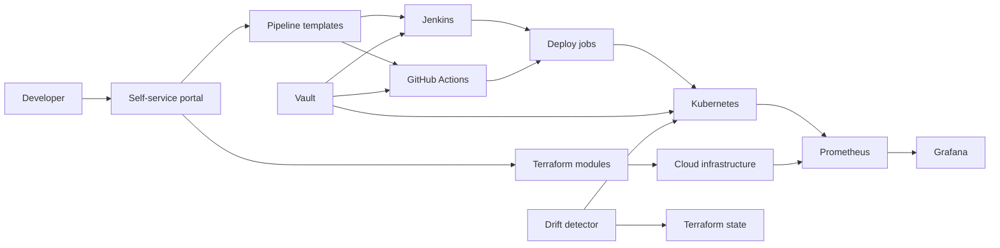

# Automated Infrastructure & Deployment Platform

Automated Infrastructure & Deployment Platform is an internal developer platform for platform engineers and product teams to self-service infrastructure and CI/CD in minutes. Think "Platform Engineering in a box": the portal renders Terraform and Jenkins/GitHub Actions templates on demand (e.g., provision a full CI/CD stack with one click).

[](https://github.com/MirceaStefanescu/Portofolio/actions/workflows/ci.yml)
[](https://github.com/MirceaStefanescu/Portofolio/actions/workflows/codeql.yml)

## Demo
- Live: TBD
- Video or GIF: TBD
- Screenshots:
  - `docs/screenshots/20251228_1728_Automated Deployment Hub_simple_compose_01kdjs4gt6ecwvwzf7axpd3xy0.png`
  - `docs/screenshots/20251228_1728_Automated Deployment Hub_simple_compose_01kdjs4gt7f1ztphzn9c0kwrpe.png`
  - `docs/screenshots/20251228_1728_Automated Deployment Hub_simple_compose_01kdjs4gt8ej1bwxq5hnkrmjps.png`
  - `docs/screenshots/20251228_1728_Automated Deployment Hub_simple_compose_01kdjs4gt9eg4rs8rzdwstz937.png`
- Local: http://localhost:8080 (after `make dev`)


## Why this exists
Teams lose days to manual infrastructure setup, one-off pipeline scripts, and inconsistent deployment patterns. This platform standardizes the workflow so new services can go from request to pipeline and infra templates in minutes, cutting onboarding time, reducing drift, and making audits easier.

## Features
- Self-service portal for infra and CI/CD template generation
- Terraform module catalog for reproducible infrastructure provisioning
- Jenkins and GitHub Actions pipeline templates per request
- Helm values generation for environment-specific app releases
- Vault-backed secret injection with short-lived tokens
- Prometheus and Grafana dashboards for platform health

## Architecture


Component flow: developers request infra and pipelines through the portal UI. The portal API renders templates from `portal/templates` and exposes `/api/metrics` for Prometheus. Terraform modules provision cloud resources, Helm charts deploy apps to Kubernetes, Vault brokers secrets, and Prometheus/Grafana provide visibility. Drift detection compares Terraform state and Kubernetes manifests to actual state and supports rollback. More detail in `docs/architecture.md`.

## Tech stack
- Backend: Node/Express for lightweight request handling and template rendering.
- Frontend: static portal UI served by the API for fast local demos.
- Infra: Terraform modules for reusable infrastructure definitions and drift checks.
- Delivery: Helm charts for Kubernetes deployments with environment overrides.
- CI: Jenkins and GitHub Actions to cover legacy and GitHub-native pipelines.
- Security: HashiCorp Vault for secrets brokering and short-lived tokens.
- Observability: Prometheus and Grafana for metrics and dashboards.
- Local dev: Docker Compose and Make to standardize startup.

## Quickstart (local)
Prereqs:
- Docker and Docker Compose
- Make
- Terraform, Helm, kubectl (only needed for infra/deploy steps)

Run:
```
make dev
```
Then open `http://localhost:8080` to generate pipelines and templates.

Optional config:
- `cp .env.example .env` and override service URLs, tokens, and log level.
- Structured logs are emitted to stdout; example in `docs/logging.md`.

Example usage: provision a Jenkins pipeline for a Node.js app
1) Open the portal and enter `orders-api`, environment `dev`, provider `jenkins`.
2) Click "Generate Pipeline" to download the Jenkinsfile template.
3) Click "Generate Terraform" and "Generate Helm" for infra and deploy values.
4) Commit templates to the service repo and run CI to provision and deploy.

Service URLs (local):
- Portal: http://localhost:8080
- Jenkins: http://localhost:8081
- Vault: http://localhost:8200
- Prometheus: http://localhost:9090
- Grafana: http://localhost:3000

## Tests
```
make test
```

## Security
Secrets: use `.env` (see `.env.example`). Vault handles runtime secret injection. Threat model basics live in `docs/threat-model.md`. Security policy is in `SECURITY.md`. Enable secret scanning in GitHub; Dependabot config lives in `.github/dependabot.yml`.

## Notes / limitations
- Status: MVP prototype focused on template generation and local demos.
- Terraform modules are illustrative and do not target a specific cloud by default.
- CI pipelines focus on structure and integration points, not full production hardening.
- Portal generates templates without applying them to a real cluster by default.

## Roadmap / tradeoffs
- Add policy-as-code (OPA/Conftest) for Terraform and Helm.
- Implement SSO and RBAC for portal access.
- Add preview environments and canary deploys.
- Tradeoff: supporting both Jenkins and GitHub Actions increases template maintenance.

## Decisions and rationale
- Jenkins plus GitHub Actions keeps legacy jobs compatible while enabling GitHub-native workflows.
- Terraform modules and Helm charts provide reusable, auditable building blocks.
- Vault centralizes secret management to avoid per-pipeline secret sprawl.
