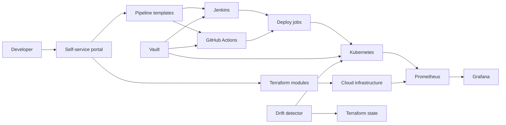

# Automated Infrastructure & Deployment Platform

Internal self-service platform that standardizes application delivery and infrastructure provisioning for product teams and platform engineers.

## Demo
- Live: TBD
- Video or GIF: TBD
- Screenshots: docs/screenshots/
- Local: http://localhost:8080 (after `make dev`)

## Why this exists
Role: DevOps Engineer. We needed a repeatable way to provision infra and deploy apps without ticket queues or hand-crafted pipelines. The platform enforces standards, reduces drift, and improves auditability while keeping teams self-service. Skills and deliverables: Terraform, Jenkins, GitHub, CI/CD, HashiCorp Vault.

## Features
- Terraform module catalog for reproducible infra provisioning
- Helm-based app releases with environment-specific values
- Portal + API generate Jenkins/GitHub Actions pipelines and Terraform/Helm templates
- Vault-backed secret injection with short-lived tokens
- Prometheus and Grafana dashboards for service and pipeline health
- Drift detection and rollback using Terraform state and Kubernetes manifests

## Architecture


Component flow: developers request infra and pipelines through the portal UI, backed by a portal API that renders templates from `portal/templates` and exposes `/api/metrics` for Prometheus. Terraform modules provision cloud resources, Helm charts deploy apps to Kubernetes, Vault brokers secrets, and Prometheus/Grafana provide visibility. Drift detection compares Terraform state and Kubernetes manifests to actual state and supports rollback.

## Tech stack
- Backend: Node/Express portal API that generates pipelines and infra templates on demand.
- Frontend: static portal UI served by the API with live previews and downloads.
- Infra: Terraform modules for reusable infrastructure definitions and drift detection.
- Delivery: Helm charts for Kubernetes deployments with environment overrides.
- CI: Jenkins and GitHub Actions to cover legacy and GitHub-native pipelines.
- Security: HashiCorp Vault for secrets brokering and short-lived tokens.
- Observability: Prometheus and Grafana for metrics and dashboards.
- Local dev: Docker Compose and Make to standardize startup.

## Quickstart (local)
Prereqs:
- Docker and Docker Compose
- Make
- Terraform, Helm, kubectl (for infra and deployment commands)

Run:
```
make dev
```
Then open `http://localhost:8080` to generate pipelines and templates.
Optional: copy `.env.example` to `.env` to override service URLs.

Service URLs:
- Portal: http://localhost:8080
- Jenkins: http://localhost:8081
- Vault: http://localhost:8200
- Prometheus: http://localhost:9090
- Grafana: http://localhost:3000

## Tests
```
make test
```

## Security
Secrets: use .env (see .env.example). Vault handles runtime secret injection. Threat model basics in `docs/threat-model.md`. Secret scanning should be enabled in GitHub.

## Notes / limitations
- Terraform modules are illustrative and do not target a specific cloud provider by default.
- CI pipelines focus on structure and integration points, not full production hardening.
- Portal generates templates without applying them to a real cluster by default.

## Roadmap / tradeoffs
- Add policy-as-code (OPA/Conftest) for Terraform and Helm.
- Implement SSO and RBAC for portal access.
- Add preview environments and canary deploys.
- Tradeoff: supporting both Jenkins and GitHub Actions increases template maintenance.

## Decisions and rationale
- Jenkins plus GitHub Actions keeps legacy jobs compatible while enabling GitHub-native workflows.
- Terraform modules and Helm charts provide reusable, auditable building blocks.
- Vault centralizes secret management to avoid per-pipeline secret sprawl.
