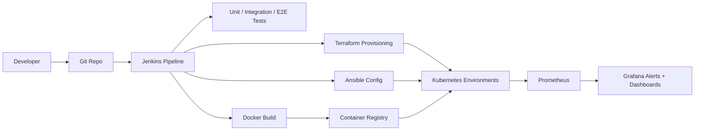

# CI/CD Pipeline Automation

Automated CI/CD pipeline for web teams that need repeatable builds,
containerized releases, and zero-downtime deployments across dev, staging, and
production environments.

## Demo
- Live: TBD
- Video or GIF: TBD
- Screenshots: `screenshots/` (add PNG/GIFs here)
- Local: http://localhost:8080 (after `make dev`)

## Why this exists
Teams often ship changes through inconsistent pipelines that are hard to audit
and impossible to reproduce. This project standardizes CI/CD for web
applications: Jenkins orchestrates builds and tests, Docker packages immutable
images, Terraform provisions environments, Ansible applies configuration, and
Kubernetes deploys with blue-green or rolling strategies. Prometheus and Grafana
surface health and deployment signals across every environment.

## Features
- Jenkins pipeline with build, test, container, and deploy stages.
- Docker image packaging with environment-specific tags.
- Terraform provisioning for Kubernetes namespaces and optional AWS/EKS targets.
- Ansible configuration management for environment settings and rollouts.
- Blue-green and rolling deployment options with zero downtime.
- Prometheus metrics and Grafana dashboards for monitoring and alerting.

## Architecture


Jenkins orchestrates testing, image builds, provisioning, and deployments.
Terraform creates the environment on Kubernetes, Ansible applies configuration
and rollout options, and the deployment pulls immutable Docker images. Metrics
and alerts flow to Prometheus and Grafana to validate releases and uptime.

## Tech stack
- Backend: Node.js + Express for a lightweight demo web service.
- Containerization: Docker for immutable, reproducible images.
- Infra: Terraform + Kubernetes for environment provisioning, with AWS-ready inputs.
- Config management: Ansible for config templates and rollout actions.
- CI/CD: Jenkins for pipeline orchestration.
- Observability: Prometheus + Grafana for metrics and alerts.
- Tests: Jest + Supertest for unit, integration, and e2e coverage.

## Quickstart (local)
Prereqs:
- Node.js 20+
- Docker and Docker Compose
- Make (optional)

Run:
```
cp .env.example .env  # optional
make dev
# or: make dev-app
```
`make dev` runs the app plus Prometheus and Grafana via Docker Compose.

Access:
- App: http://localhost:8080
- Prometheus: http://localhost:9090
- Grafana: http://localhost:3000 (admin / admin)

Endpoints:
- `/health`
- `/api/info`
- `/api/status`
- `/metrics`

Kubernetes demo (optional):
```
make kind-up
make docker-build
make deploy-blue
kubectl -n cicd-demo port-forward svc/cicd-demo 8080:80
make deploy-green
```
Rolling strategy:
```
make deploy-rolling
```

CI pipeline simulation (optional):
```
RUN_TERRAFORM=true RUN_ANSIBLE=true RUN_DEPLOY=true \
DEPLOY_MODE=blue-green RELEASE_COLOR=green IMAGE_TAG=local \
make ci
```

Infrastructure provisioning (optional):
```
make terraform-init
make terraform-apply
make ansible-config
```

AWS EKS (optional, existing cluster):
```
terraform -chdir=terraform/environments/aws-eks init
terraform -chdir=terraform/environments/aws-eks apply -var="cluster_name=your-eks" -var="image=cicd-demo:local"
```

## Tests
```
make test
# or:
npm run test:unit
npm run test:integration
npm run test:e2e
```

## Security
Secrets: use `.env` (see `.env.example`). Never commit real credentials. Store
registry, Jenkins, and cloud keys in a secret manager or Jenkins credentials
store. Threat model: untrusted web requests and CI/CD credentials exposure;
mitigate with RBAC, least-privilege IAM, and network policies in production.

## Notes / limitations
- Status: fully functional local demo; cloud provisioning requires credentials.
- Jenkins pipeline assumes Docker, Terraform, kubectl, and Ansible are available.
- AWS EKS environment expects an existing cluster; cluster provisioning not included.

## Project structure
- `src/`: Express API and metrics endpoints.
- `public/`: Static UI for build/deploy metadata.
- `screenshots/`: Demo images for the README.
- `tests/`: Unit, integration, and end-to-end tests.
- `monitoring/`: Prometheus config and Grafana dashboard provisioning.
- `k8s/`: Blue-green and rolling Kubernetes manifests.
- `terraform/`: Reusable module plus local-kind and AWS EKS environments.
- `ansible/`: Playbooks and templates for app configuration.
- `scripts/`: CI/CD helper scripts and deployment wrappers.
- `Jenkinsfile`: Pipeline definition.

## Roadmap / tradeoffs
- Add policy-as-code (OPA/Conftest) gates for Terraform and Kubernetes changes.
- Add canary deployments alongside blue-green.
- Tradeoff: blue-green releases double temporary capacity to reduce risk.

## Decisions and rationale
- Jenkins remains common in enterprise environments, so it anchors the pipeline.
- Terraform standardizes environment creation and keeps infra auditable.
- Ansible is used for repeatable config changes across environments.

## Tags
devops, docker, jenkins, ansible, terraform, kubernetes, ci/cd

## Skills and tools
Tools and software: jenkins, docker, terraform, ansible, kubernetes, prometheus,
grafana.

Skills: devops, ci/cd.
