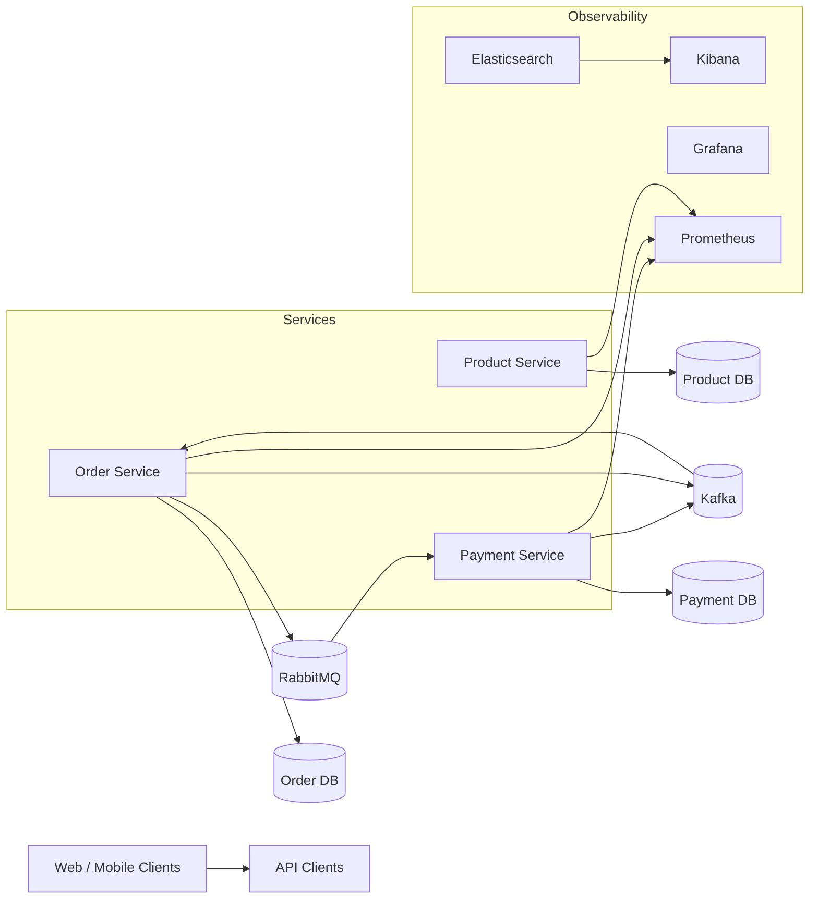

# Cloud-Native E-Commerce Platform

Cloud-native e-commerce platform for teams that need reliable product, order, and payment APIs with event-driven workflows.

This project demonstrates a production-minded microservices baseline with REST APIs, async messaging, and Kubernetes-ready operational patterns.

## Features
- Product, order, and payment REST APIs with independent data stores
- RabbitMQ command queue for payment requests
- Kafka event streams for order and payment events
- Docker Compose for one-command local run
- Kubernetes manifests for deployments and services
- Prometheus metrics and optional Grafana/Kibana observability stack

## Tech stack (and why)
- Backend: Python FastAPI for fast iteration and clean RESTful APIs.
- Messaging: RabbitMQ for command queues, Kafka for durable event streams.
- Infra: Docker Compose for local dev; Kubernetes manifests for deployment.
- CI: Jenkins pipeline for lint, test, build, and container publishing.
- IaC: Terraform scaffold for AWS EKS baseline.
- Observability: Prometheus + Grafana for metrics; Elasticsearch + Kibana for logs.

## Demo
- Live: TBD
- Video or GIF: TBD
- Screenshots: `docs/screenshots/`

## Quickstart (local)
Prereqs:
- Docker and Docker Compose

Run:
```
make dev
```

Create a product:
```
curl -X POST http://localhost:8010/products \
  -H "Content-Type: application/json" \
  -d '{"name":"Coffee Beans","description":"1kg bag","price_cents":1899,"currency":"USD"}'
```

Create an order:
```
curl -X POST http://localhost:8020/orders \
  -H "Content-Type: application/json" \
  -d '{"customer_id":"cust-123","items":[{"product_id":"<PRODUCT_ID>","quantity":2}]}'
```

Check order status:
```
curl http://localhost:8020/orders/<ORDER_ID>
```

RabbitMQ UI:
- http://localhost:15672 (guest / guest)

Optional observability stack:
```
docker compose -f docker-compose.yml -f docker-compose.observability.yml up --build
```

## Architecture


Data flow: orders are created via REST, the order service publishes a payment request to RabbitMQ, the payment service processes the request, emits a payment event to Kafka, and the order service consumes that event to update order status.

## Tests
```
make test
```

## Security
Secrets: use `.env` (see `.env.example`). No secrets are committed. For production: enable auth (OAuth/JWT), use TLS for RabbitMQ/Kafka, restrict topics/queues, and apply network policies. This demo assumes a trusted internal network and does not include rate limiting or WAF rules.

## Roadmap / tradeoffs
- Add API gateway with auth and rate limits.
- Introduce saga orchestration and idempotent payment retries.
- Replace local SQLite with per-service PostgreSQL.
- Tradeoff: keeping services lightweight makes local runs easy but omits advanced resilience patterns.

## Notes / limitations
- Local demo uses SQLite for simplicity; swap for managed databases (RDS/Aurora) in production.
- Observability stack is optional; Kibana requires a log shipper (see `monitoring/filebeat/`).

## Decisions and rationale
- Split by business capability to keep services independently deployable.
- Used RabbitMQ for command-style messaging and Kafka for event streams.
- Chose FastAPI to keep implementation compact while remaining production-friendly.

### Mirroring to GitHub
- Keep local-only files in `.gitignore` (`AGENTS.md`, `.env`, etc).
- Commit in logical chunks with clear messages.
- Push after README/CI/quickstart remain accurate.
- Keep Actions, Dependabot, and secret scanning enabled.
