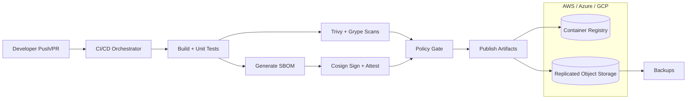

# DevSecOps Pipeline with SBOM & SLSA

Automated CI/CD pipeline template for regulated teams that need SBOMs, signed artifacts, and policy gates across AWS, Azure, and GCP.

## Demo
- Live: TBD
- Video or GIF: TBD
- Screenshots: TBD

## Why this exists
Supply chain risk and compliance requirements make it hard to ship quickly without compromising auditability. This project standardizes SBOM generation, dependency and container scanning, artifact signing, and policy gates so teams can produce repeatable, verifiable releases across multi-cloud environments.

## Features
- Generates SBOMs (CycloneDX) for container images.
- Scans dependencies and images with Trivy and Grype and enforces severity thresholds.
- Signs images, SBOMs, and provenance attestations with Cosign.
- Policy gates block releases that fail vulnerability checks.
- Multi-cloud, high availability pipeline with replicated artifact storage and backups.
- Audit-ready metadata and repeatable release promotions.

## Architecture


CI builds produce artifacts and SBOMs, which are scanned and signed before policy gates allow promotion. Signed artifacts and SBOMs are stored in replicated object storage with backups, while container images are pushed to the registry in each cloud for high availability.

## Tech stack (and why)
- GitHub Actions: repo-native CI workflows with policy gates and traceable runs.
- Jenkins: enterprise CI option for hybrid environments and regulated networks.
- Docker: reproducible image builds and scan targets.
- Kubernetes: resilient runners and controlled deployment environments.
- Terraform: multi-cloud IaC for CI, storage, and registries.
- Trivy + Grype: complementary vulnerability scanners for dependencies and images.
- Cosign: artifact signing and SLSA-style attestations.

## Quickstart (local)
Prereqs:
- Docker
- Make (optional)

Run:
```
cp .env.example .env
# update COSIGN_PASSWORD in .env before first run
make dev
```

Outputs:
- `artifacts/`: SBOM, dependency and image scan reports, and SBOM signature.
- `storage/`: replicated artifacts for AWS/Azure/GCP simulation.
- `backups/`: timestamped backups of artifacts.

Verify signatures:
```
make verify
```

Stop local registry:
```
make down
```

## Tests
```
make test
```

## Security
Secrets: use `.env` for local Cosign keys, prefer KMS or keyless OIDC in CI, keep registry and artifact storage access in least-privilege IAM roles, and enforce policy gates before promotion. Enable secret scanning and dependency alerts in GitHub.

## Notes / limitations
- Local storage is simulated with filesystem replication; replace with S3/Blob/GCS in production.
- The demo pipeline signs with a local key; CI can switch to keyless signing via OIDC.

## Roadmap / tradeoffs
- Add SLSA level 3 provenance with isolated builders and hermetic builds.
- Add policy-as-code bundles for license and provenance enforcement.
- Tradeoff: stronger gates improve security but slow down release throughput.

## Decisions and rationale
- Containerized scanners keep local requirements minimal.
- Local registry enables image signing and attestations without external dependencies.
- File-based replication provides a fast local simulation of multi-cloud object storage.

## Project structure
- `app/`: demo container image used by the pipeline.
- `scripts/pipeline.sh`: local end-to-end pipeline runner.
- `policy/provenance.json`: sample SLSA-style provenance predicate.
- `ci/github-actions/pipeline.yml`: GitHub Actions pipeline template.
- `ci/jenkins/Jenkinsfile`: Jenkins pipeline template.

## Tags
security, docker, kubernetes, ci/cd, devsecops, github actions, sbom, slsa

## Skills and tools
Tools and software: docker, jenkins, terraform, kubernetes, github actions, trivy, grype, cosign.

Skills: java, security, kubernetes, spring boot, ci/cd.
