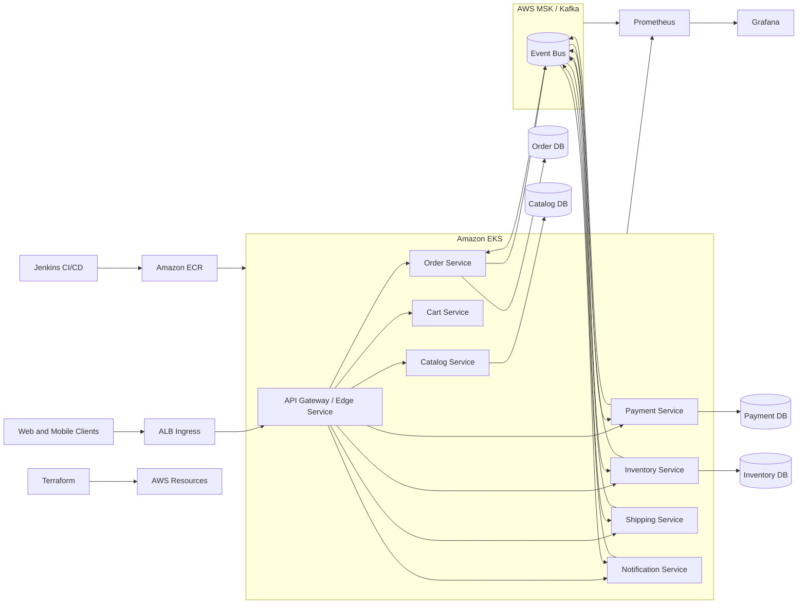

# Event-Driven E-Commerce Platform

Event-driven e-commerce platform for high-traffic retail teams that need scalable, fault-tolerant order processing.

## Demo
- Live: TBD
- Video or GIF: TBD
- Screenshots: TBD

## Why this exists
Retail checkout flows cannot afford downtime or tight coupling between services during traffic spikes. The goal is to decouple order processing, payments, inventory, and shipping while preserving traceability and recovery from partial failures. Role: Java Engineer. Skills and deliverables: Spring Boot, Apache Kafka, Amazon Web Services, Terraform, Jenkins.

## Features
- Microservices for catalog, cart, order, payment, inventory, shipping, and notifications
- Kafka-based event choreography with retries and dead-letter topics for resiliency
- Amazon EKS deployment with rolling updates and autoscaling
- Terraform IaC for VPC, MSK, EKS, and supporting services
- Jenkins pipeline for build, test, container publish, and deploy stages
- Prometheus metrics and Grafana dashboards for service and business KPIs

## Architecture


Event-driven flow: services publish domain events (order.created, payment.authorized, inventory.reserved) to Kafka on MSK. Downstream services react asynchronously to maintain loose coupling, with retries and DLQs for fault handling. Jenkins builds and pushes container images to ECR, then deploys to EKS. Prometheus scrapes service metrics and MSK brokers, while Grafana visualizes SLIs and business KPIs.

## Tech stack
- Backend: Spring Boot (Java 17) microservices with Actuator metrics for production readiness.
- Frontend: external web/mobile clients via an edge/API gateway service.
- Infra: Amazon EKS + Docker for orchestration and AWS MSK for managed Kafka.
- CI: Jenkins pipelines for build, test, image publish, and deploy.
- Observability: Prometheus for metrics and Grafana dashboards for SLIs and business KPIs.

## Quickstart (local)
Prereqs:
- Docker and Docker Compose
- Java 17+ (optional for running services outside Docker)

Run:
```
# TODO: add docker-compose.yml and service stubs.
# Expected once scaffolding exists:
# docker compose up --build
```

## Tests
```
# TODO: add per-service tests (example):
# mvn test
```

## Security
Secrets: use `.env` (see `.env.example`). Prefer IAM roles for service-to-service AWS access, encrypt MSK and databases at rest, and restrict topics with ACLs. Enable secret scanning in GitHub.

## Notes / limitations
- This repository documents the target architecture; runnable services and IaC modules are not yet checked in.
- Demo media is pending.

## Roadmap / tradeoffs
- Add saga orchestration for long-running workflows.
- Introduce schema registry and contract testing for event evolution.
- Tradeoff: event choreography improves decoupling but increases observability complexity.

## Decisions and rationale
- Chose event-driven choreography to reduce coupling and allow independent scaling.
- Kept per-service databases to avoid shared schema bottlenecks.
- Standardized on AWS managed services (EKS, MSK) to reduce operational overhead.
- Centralized metrics on Prometheus/Grafana to surface SLIs and business KPIs.

### Mirroring to GitHub
- Keep local-only files in `.gitignore` (`AGENTS.md`, `.env`, etc).
- Commit in logical chunks with clear messages.
- Push after README/CI/quickstart remain accurate.
- Keep Actions, Dependabot, and secret scanning enabled.
