# Event-Driven E-Commerce Platform

Event-driven e-commerce platform for high-traffic retail teams that need scalable, fault-tolerant order processing. The goal is to decouple order processing, payments, inventory, and shipping while preserving traceability and recovery from partial failures. Role: Java Engineer. Skills and deliverables: Spring Boot, Apache Kafka, Amazon Web Services, Terraform, Jenkins.

## Features
- Microservices for catalog, cart, order, payment, inventory, shipping, and notifications
- Kafka-based event choreography with retries and dead-letter topics for resiliency
- Amazon EKS deployment with rolling updates and autoscaling
- Terraform IaC for VPC, MSK, EKS, and supporting services
- Jenkins pipeline for build, test, container publish, and deploy stages
- Prometheus metrics and Grafana dashboards for service and business KPIs

## Tech stack (and why)
- Backend: Spring Boot (Java 17) microservices with Actuator metrics for production readiness.
- Eventing: Apache Kafka on AWS MSK for durable, replayable streams.
- Infra: Amazon EKS + Docker for orchestration and horizontal scaling.
- CI: Jenkins pipelines for build, test, image publish, and deploy.
- Observability: Prometheus metrics and Grafana dashboards for SLIs and business KPIs.

## Demo
- Live: TBD
- Video or GIF: TBD
- Screenshots:
  - `docs/screenshots/20251228_1737_Scalable E-Commerce System_simple_compose_01kdjsmnz6e53rqfyhcxcva2v5.png`
  - `docs/screenshots/20251228_1737_Scalable E-Commerce System_simple_compose_01kdjsmnz7exyr3dtcvf2ds3cb.png`
  - `docs/screenshots/20251228_1737_Scalable E-Commerce System_simple_compose_01kdjsmnz8er9t65yx5vh4btk8.png`
  - `docs/screenshots/20251228_1737_Scalable E-Commerce System_simple_compose_01kdjsmnz9fnbr3ggv204mhjyp.png`


## Quickstart (local)
Prereqs:
- Docker and Docker Compose
- Java 17+ and Maven (optional for running tests)

Run:
```
make dev
```

Send an order:
```
curl -X POST http://localhost:18081/api/orders \\
  -H \"Content-Type: application/json\" \\
  -d '{\"customerId\":\"cust-123\",\"items\":[{\"sku\":\"SKU-123\",\"quantity\":2}]}'
```

Check inventory:
```
curl http://localhost:18082/api/inventory/SKU-123
```

Dashboards:
- Prometheus: http://localhost:9091
- Grafana: http://localhost:13000 (admin / admin)

Docs:
- API: `docs/api.md`
- Event contracts: `docs/events.md`

## Architecture

```mermaid
flowchart LR
  Users[Web and Mobile Clients] --> ALB[ALB Ingress]
  ALB --> Edge[API Gateway / Edge Service]
  subgraph EKS[Amazon EKS]
    Edge --> Catalog[Catalog Service]
    Edge --> Cart[Cart Service]
    Edge --> Order[Order Service]
    Edge --> Payment[Payment Service]
    Edge --> Inventory[Inventory Service]
    Edge --> Shipping[Shipping Service]
    Edge --> Notify[Notification Service]
  end

  Order --> OrderDB[(Order DB)]
  Payment --> PaymentDB[(Payment DB)]
  Inventory --> InventoryDB[(Inventory DB)]
  Catalog --> CatalogDB[(Catalog DB)]

  subgraph MSK[AWS MSK / Kafka]
    Kafka[(Event Bus)]
  end

  Order --> Kafka
  Payment --> Kafka
  Inventory --> Kafka
  Shipping --> Kafka
  Notify --> Kafka
  Kafka --> Order
  Kafka --> Payment
  Kafka --> Inventory
  Kafka --> Shipping
  Kafka --> Notify

  Jenkins[Jenkins CI/CD] --> ECR[Amazon ECR]
  ECR --> EKS
  Terraform[Terraform] --> AWS[AWS Resources]

  Prometheus[Prometheus] --> Grafana[Grafana]
  EKS --> Prometheus
  MSK --> Prometheus
```


Event-driven flow: services publish domain events (order.created, payment.authorized, inventory.reserved) to Kafka on MSK. Downstream services react asynchronously to maintain loose coupling, with retries and DLQs for fault handling. Jenkins builds and pushes container images to ECR, then deploys to EKS. Prometheus scrapes service metrics and MSK brokers, while Grafana visualizes SLIs and business KPIs.

## Tests
```
make test
```

## Security
Secrets: use `.env` (see `.env.example`). Prefer IAM roles for service-to-service AWS access, encrypt MSK and databases at rest, and restrict topics with ACLs. The local scaffold is unauthenticated; add OAuth/JWT and network policies for production. Enable secret scanning in GitHub.

## Roadmap / tradeoffs
- Add saga orchestration for long-running workflows.
- Introduce schema registry and contract testing for event evolution.
- Tradeoff: event choreography improves decoupling but increases observability complexity.

## Notes / limitations
- Status: MVP with Order and Inventory services runnable locally.
- Additional services are described in the architecture section.
- AWS/Terraform/Jenkins definitions are documented but not yet checked in for this local demo.

## Decisions and rationale
- Chose event-driven choreography to reduce coupling and allow independent scaling.
- Kept per-service databases to avoid shared schema bottlenecks.
- Standardized on AWS managed services (EKS, MSK) to reduce operational overhead.
- Centralized metrics on Prometheus/Grafana to surface SLIs and business KPIs.

### Mirroring to GitHub
- Keep local-only files in `.gitignore` (`AGENTS.md`, `.env`, etc).
- Commit in logical chunks with clear messages.
- Push after README/CI/quickstart remain accurate.
- Keep Actions, Dependabot, and secret scanning enabled.
