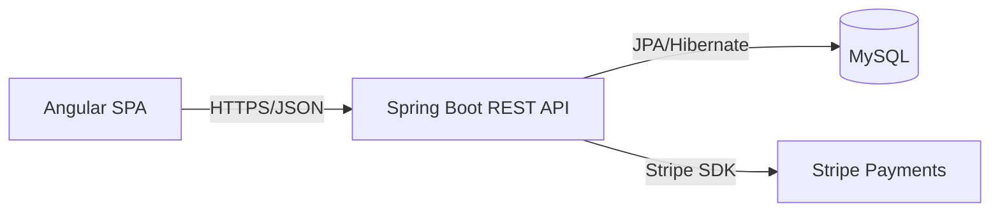

# Full Stack E-commerce Application with Angular and Spring Boot

Full-stack e-commerce web app for shoppers and store owners, built as an Angular single-page application with a Spring Boot REST API and Stripe payments.

This project demonstrates an end-to-end online shop with a modern SPA UI, RESTful APIs, and external payment integration.

## Features
- JWT-based authentication with bcrypt-hashed passwords
- Product catalog with categories and seeded sample data
- Shopping cart with quantity updates and total calculations
- Checkout flow with Stripe payment intents (demo mode supported)
- Order creation, confirmation, and history APIs

## Tech stack
- Backend: Spring Boot 4 (Java 21), Spring Security, JPA/Hibernate, JWT (mature, production-ready REST stack)
- Frontend: Angular 21, TypeScript, RxJS (typed SPA with component-driven UI)
- Infra: MySQL 8, Docker Compose, Nginx, Stripe API (local parity and external payment integration)
- CI: GitHub Actions (planned)

## Demo
- Live: Not deployed yet.
- Video or GIF: Add a 60 to 120 second walkthrough.
- Screenshots:
  - `docs/screenshots/20251228_1739_E-commerce App Showcase_simple_compose_01kdjss6bzee4tyb7jj380myyp.png`
  - `docs/screenshots/20251228_1739_E-commerce App Showcase_simple_compose_01kdjss6c0fjjv7jkk2n500ejv.png`
  - `docs/screenshots/20251228_1739_E-commerce App Showcase_simple_compose_01kdjss6c1ejjs4dbh4xrf43ar.png`
  - `docs/screenshots/20251228_1739_E-commerce App Showcase_simple_compose_01kdjss6c2f78b0a76nd46n7dp.png`


## Quickstart (local)
Prereqs:
- Docker (recommended)
- Or: Node.js 20+, Angular CLI, Java 21, Maven, MySQL 8+

Run with Docker (one command):
```bash
docker compose up --build
```
Then open `http://localhost:4200`.

Run without Docker:
```bash
# backend
cd backend
cp .env.example .env
./mvnw spring-boot:run

# frontend
cd ../frontend
npm install
npm run start
```

Frontend config:
- Update `frontend/src/app/core/config/app-config.ts` for `API_BASE_URL` and `STRIPE_PUBLISHABLE_KEY`.

Usage:
- Register a user, browse the catalog, add items to the cart, and checkout.
- Stripe test card: `4242 4242 4242 4242` with any future expiry and CVC.

Sample data:
- The backend seeds a few products on first run.

## Architecture

The Angular app runs as a SPA (dev server or Nginx in Docker) and talks to the Spring Boot API over JSON. The backend persists data in MySQL and integrates with Stripe for payment intents. See `docs/architecture.md` for more detail.

## Tests
```bash
# backend
cd backend
./mvnw test

# frontend
cd ../frontend
npm test
```

## Security
Secrets are loaded from environment variables (`backend/.env`, see `backend/.env.example`). Authentication uses Spring Security with JWTs, bcrypt password hashing, and Jakarta Validation for request input. This is a demo app and does not include production hardening like rate limiting, audit logging, or advanced fraud checks.

## Roadmap / tradeoffs
- Add UI screenshots and a short demo video.
- Add GitHub Actions CI for backend and frontend checks.
- Add integration tests for checkout and order confirmation.
- Add a live demo deployment with seeded data.

## Notes / limitations
- CORS is restricted to localhost origins by default.
- Stripe runs in demo mode when no secret key is configured.
- REST endpoints include `GET /api/products`, `POST /api/auth/login`, and `POST /api/orders`.

## Decisions and rationale
- Angular SPA + REST API keeps UI and backend concerns decoupled for easier iteration.
- JWT auth enables stateless scaling and clean API boundaries.
- Docker Compose ensures a one-command local run with consistent dependencies.
