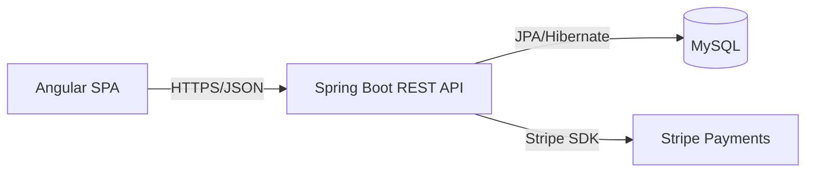

# Architecture

## High-level diagram

## Components
- Angular SPA: product browsing, cart management, and checkout UI.
- Spring Boot API: authentication, catalog, order management, and Stripe integration.
- MySQL: persistence for products, users, and orders.
- Stripe: payment intent creation and confirmation.

## Checkout flow (happy path)
1. User signs up or logs in to obtain a JWT.
2. Client creates an order with cart items via `POST /api/orders`.
3. Backend calculates totals and creates a Stripe payment intent.
4. Client confirms payment using the intent client secret.
5. Client calls `POST /api/orders/{id}/confirm` to finalize the order.

## Local ports
- Frontend (dev): `http://localhost:4200`
- Backend API: `http://localhost:8080`
- MySQL: `localhost:3306`
