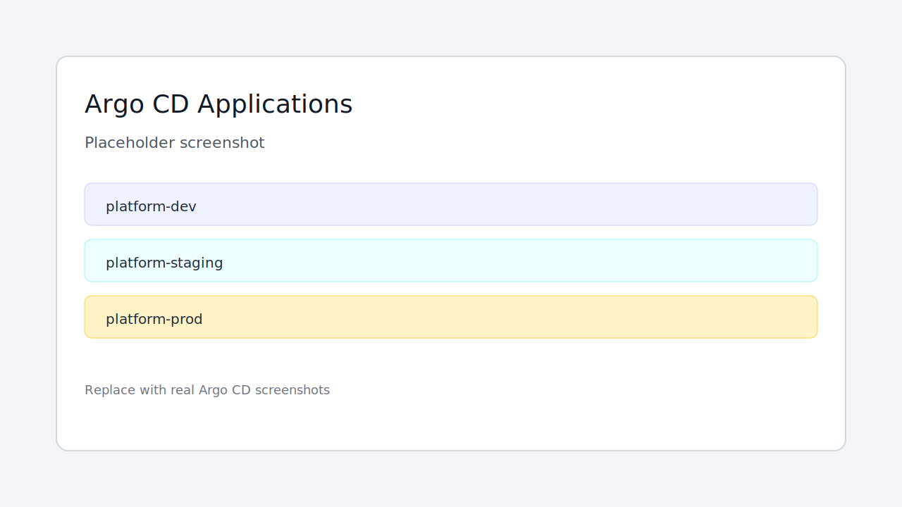
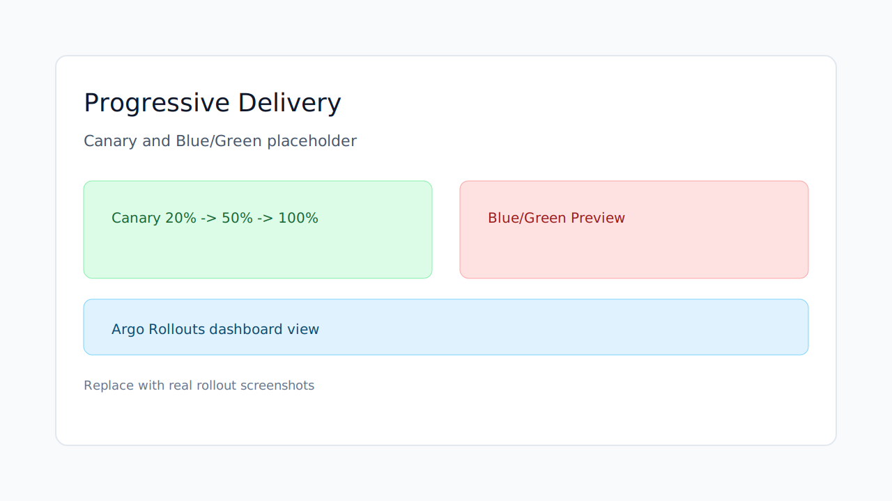
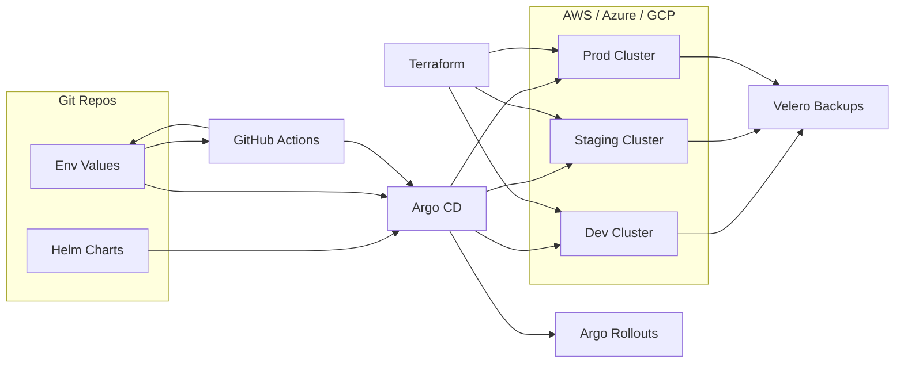

# GitOps Platform - Argo CD & Helm

GitOps delivery platform for platform engineers and SREs who need repeatable, auditable multi-environment microservice deployments with fast rollbacks and disaster recovery.

## Features
- Argo CD app-of-apps manages dev/staging/prod with drift detection and self-healing.
- Helm charts with environment-specific values stored in Git for consistent releases.
- GitHub Actions promotion pipelines update env values and trigger Argo CD syncs with approvals.
- Terraform provisions EKS/AKS/GKE clusters with shared networking and IAM baselines.
- Progressive delivery (canary and blue/green) with automated rollback gates.
- Velero backups for cluster state and persistent volumes to support DR.

## Tech stack (and why)
- Argo CD: GitOps reconciliation, drift detection, and audit trails.
- Helm: templated manifests and per-environment configuration.
- GitHub Actions: promotion automation plus CI checks for Helm and Terraform.
- Terraform: consistent multi-cloud provisioning for Kubernetes clusters.
- Kubernetes (EKS/AKS/GKE): managed clusters across dev/staging/prod.
- Argo Rollouts: canary and blue/green deployments with rollback controls.
- Velero: backup and restore workflows for disaster recovery.
- Docker: consistent build/runtime for CI jobs and tooling.

## Demo
Live: TBD

Video or GIF:


Screenshots:



## Quickstart (local)
Prereqs:
- Docker
- kind
- kubectl
- Helm
- Make
- Terraform (for cloud provisioning)

Run:
```
make dev
```
This creates a local kind cluster, installs Argo CD, Argo Rollouts, MinIO, and Velero, then bootstraps the app-of-apps.
Helm overrides for the local stack live in `infra/`.

Argo CD access:
```
make argocd-password
make port-forward-argocd
```

Promote an image tag:
```
make promote ENV=staging TAG=6.5.4 STRATEGY=blueGreen
```
GitHub Actions promotion: `.github/workflows/gitops-platform-promote.yml`.

Back up environments:
```
make backup
```

Cloud provisioning: see `terraform/README.md` for EKS, AKS, and GKE provisioning.

Note: the Argo CD manifests currently point to the portfolio repo and the `GitOps Platform - Argo CD & Helm` subfolder. Update the `repoURL` and `path` in `apps/bootstrap/app-of-apps.yaml` and `apps/environments/*.yaml` to match your mirrored repo before running Argo CD, then push so Argo CD can pull it.

## Architecture


Helm charts and environment-specific values live in Git. GitHub Actions promotes changes by updating environment values and triggering Argo CD syncs. Argo CD reconciles clusters across dev/staging/prod, with progressive delivery handled by Argo Rollouts and backups handled by Velero. Terraform provisions the multi-cloud clusters and baseline infrastructure.

## Tests
```
make test
```
CI runs the same checks; see `.github/workflows/gitops-platform-ci.yml`.

## Security
Secrets: use `.env` (see `.env.example`). Store cloud credentials in OIDC-backed GitHub Actions secrets, restrict Argo CD access with RBAC, and enable namespace isolation plus network policies between environments. Velero backups should use encrypted buckets and least-privilege IAM roles. Enable secret scanning and Dependabot in GitHub.

## Roadmap / tradeoffs
- Add policy-as-code checks (OPA/Conftest) for Helm and Terraform.
- Add promotion metrics and deployment DORA dashboards.
- Add automated verification gates for canary analysis.
- Tradeoff: multi-cloud parity improves resilience but increases operational overhead.

## Project structure
- `apps/`: Argo CD app-of-apps and per-environment Applications.
- `charts/`: Helm chart with environment overrides.
- `demo/`: placeholder demo assets (screenshots and GIF).
- `infra/`: Helm values for Argo CD and Argo Rollouts.
- `k8s/`: MinIO and Velero values plus backup manifest.
- `terraform/`: AWS, Azure, and GCP cluster baselines.
- `scripts/`: promotion helper used by GitHub Actions.
- `.github/workflows`: monorepo CI and promotion workflows for this project.
- `GitOps Platform - Argo CD & Helm/.github/workflows`: standalone workflows for a split repo.

## Tags
terraform, kubernetes, ci/cd, helm, argo cd, gitops, velero, multi-env

## Skills and tools
Tools and software: docker, terraform, kubernetes, helm, github actions, argo cd, velero.

Skills: kubernetes, devops, terraform, ci/cd.
