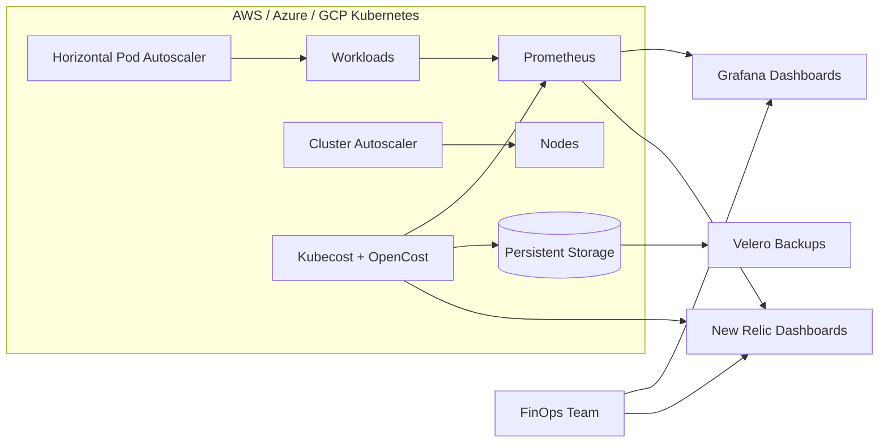

# Kubernetes FinOps & Cost Optimization

Multi-cloud FinOps framework for platform teams to reduce Kubernetes spend with Kubecost/OpenCost, autoscaling, and unified cost/performance dashboards.

This project standardizes cost allocation, right-sizing, and telemetry so teams can spot waste, tune autoscaling, and keep cost monitoring resilient.

## Features
- Kubecost/OpenCost deployed across AWS, Azure, and GCP for cost visibility and allocation.
- HPA and Cluster Autoscaler policies to right-size workloads and nodes.
- Prometheus scrape configuration with Grafana dashboards for cost, utilization, and efficiency.
- New Relic dashboards that merge cost and performance metrics.
- High availability with persistent storage and Velero backups for cost data.

## Tech stack (and why)
- Kubernetes (AWS/Azure/GCP): multi-cloud clusters for workload scheduling and cost allocation.
- Kubecost + OpenCost: cost visibility, allocation, and optimization signals.
- HPA + Cluster Autoscaler: right-sizing and node scaling.
- Prometheus + Grafana: metrics collection and cost/utilization dashboards.
- New Relic: unified cost and performance reporting.
- Helm: repeatable deployments across clusters.
- Velero: backups for persistent Kubecost data.
- MinIO (local demo): S3-compatible object storage for Velero backups.

## Demo
- Live: TBD
- Video or GIF: TBD
- Screenshots: add to `docs/screenshots/`

## Quickstart (local)
Prereqs:
- Docker
- kubectl
- Helm
- kind
- Make (optional, for one-command run)

Run:
```
cp .env.example .env  # optional
make dev
```

Configuration (optional):
- `KUBECOST_CLUSTER_ID`: cluster identifier used by Kubecost.
- `NEW_RELIC_LICENSE_KEY`: required for `make newrelic`.
- `NEW_RELIC_CLUSTER_NAME`: name shown in New Relic dashboards.
- `MINIO_ACCESS_KEY`/`MINIO_SECRET_KEY`: local MinIO credentials.
- `MINIO_BUCKET`: Velero backup bucket name.

Trigger autoscaling and cost signals:
```
make load
kubectl -n finops get hpa
```

Stop load:
```
make unload
```

Access:
```
make port-forward-kubecost
make port-forward-grafana
```

Grafana login: `admin / admin`

Backups:
```
make backup
kubectl -n velero get backups
```
Velero stores backups in the local MinIO bucket for the demo setup.

Optional New Relic integration:
```
make newrelic
```
Requires `NEW_RELIC_LICENSE_KEY` in `.env` or your shell environment.

Cluster Autoscaler (cloud):
```
helm repo add autoscaler https://kubernetes.github.io/autoscaler
helm upgrade --install cluster-autoscaler autoscaler/cluster-autoscaler -n kube-system \
  -f k8s/cluster-autoscaler/aws/values.yaml
# or: k8s/cluster-autoscaler/azure/values.yaml
# or: k8s/cluster-autoscaler/gcp/values.yaml
```
Update the placeholders in the values file for your cloud account (region, resource group, or node pool). Note: kind clusters do not scale nodes; validate Cluster Autoscaler in a cloud-backed cluster.

## Architecture


Each cluster runs Kubecost/OpenCost alongside Prometheus to collect cost and utilization metrics, while HPA and Cluster Autoscaler right-size workloads and nodes. Metrics and cost signals feed Grafana and New Relic dashboards, and Kubecost data persists to storage protected by Velero backups for resilient reporting.

## Tests
```
make test
```
Validates manifests with client-side dry-run.

## Security
Secrets: use `.env` (see `.env.example`). Store New Relic license keys in Kubernetes secrets, rotate MinIO demo credentials in real deployments, restrict Kubecost access with RBAC, and apply network policies between cost services and workloads. Enable encryption at rest for persistent volumes and lock down cloud IAM roles.

## Roadmap / tradeoffs
- Add rightsizing recommendations and cost anomaly alerts.
- Add multi-tenant chargeback reports by namespace and team.
- Integrate budget policies and auto-remediation for idle workloads.
- Tradeoff: richer telemetry improves visibility but adds runtime overhead and storage cost.

## Project structure
- `Makefile`: one-command setup and common workflows.
- `kind-config.yaml`: local multi-node kind cluster config.
- `k8s/namespace.yaml`: FinOps namespace.
- `k8s/metrics-server/values.yaml`: metrics-server Helm overrides for HPA.
- `k8s/kubecost/values.yaml`: Kubecost + Grafana Helm values.
- `k8s/minio/values.yaml`: MinIO object storage for Velero.
- `k8s/velero/values.yaml`: Velero Helm values (MinIO backend).
- `k8s/velero/backup.yaml`: sample backup definition.
- `k8s/workloads/`: demo workloads + HPA + load generator.
- `k8s/cluster-autoscaler/`: AWS/Azure/GCP values templates.

## Tags
monitoring, cost, kubernetes, autoscaling, grafana, prometheus, cost optimization, new relic, finops, kubecost

## Skills and tools
Tools and software: docker, kubernetes, grafana, helm, prometheus, new relic, hpa, cluster autoscaler, velero, kubecost, opencost.

Skills: kubernetes, devops.
