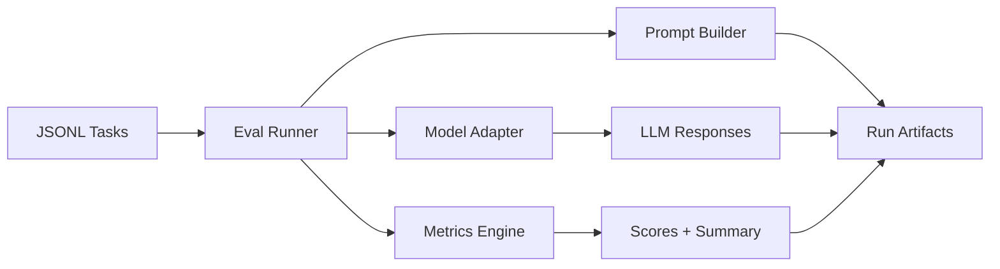

# LLMOps Evaluation Harness

Open-source evaluation harness for teams that need repeatable LLM quality checks with scored metrics and CI-friendly runs.

## Demo
- Live: TBD
- Video or GIF: TBD
- Screenshots: TBD

## Why this exists
LLM behavior drifts, and manual review does not scale. This harness provides a lightweight, repeatable way to evaluate prompts and model responses, store results, and surface regressions in CI.

## Features
- JSONL-based evaluation tasks with prompt templates and per-task metrics
- Pluggable model adapters (mock + HTTP endpoint)
- Accuracy, F1, and hallucination-rate metrics with per-run summaries
- Run artifacts stored as JSONL for easy audit and diffing
- CI-ready workflow with lint, tests, and build checks

## Architecture


The harness loads task files, generates prompts, calls a model adapter, computes metrics, and writes request/response/score artifacts into a run directory for review and CI gating.

## Tech stack
- Backend: Python 3.10+, `requests`, JSONL storage
- Frontend: N/A
- Infra: Local filesystem artifacts, optional HTTP model endpoint
- CI: GitHub Actions (lint, tests, build)

## Quickstart (local)
Prereqs:
- Python 3.10+

Run:
```
python3 -m venv .venv
source .venv/bin/activate
pip install -r requirements-dev.txt
make dev
```

## Tests
```
make test
```

## Security
Secrets: use `.env` (see `.env.example`). Do not log prompts containing sensitive data. Store API keys in CI secrets and scope model endpoints to least privilege.

## Notes / limitations
- Metrics are heuristic and intended for regression detection, not absolute truth.
- Hallucination rate uses a simple context-overlap check and should be replaced with task-specific validators for production.

### Adding evaluation tasks
1. Create a JSONL file in `datasets/` with `id`, `input`, `expected`, and optional `context`.
2. Add a task config in `tasks/` pointing to the dataset, prompt template, and metrics list.
3. Run: `python -m eval_harness.cli --task tasks/<task>.json`

### CI integration
The workflow in `.github/workflows/llmops-eval-harness-ci.yml` runs `ruff`, `pytest`, and a package build. Add your task JSONL files and keep them small for fast CI.

## Roadmap / tradeoffs
- Add task-specific graders (regex, semantic similarity, tool outputs).
- Add cached model responses to reduce eval cost.
- Tradeoff: simple metrics keep the harness portable but require careful task design.

## Decisions and rationale
- JSONL tasks keep data human-readable and easy to diff.
- Run artifacts are stored as JSONL for straightforward audit and downstream processing.
