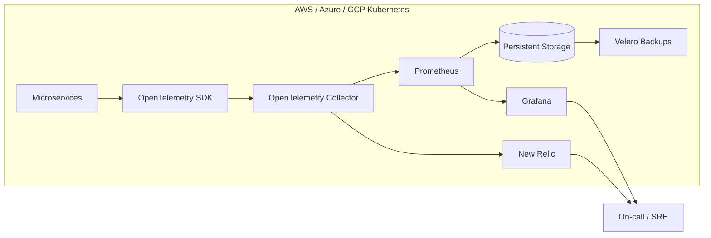

# Observability: New Relic & Prometheus

Production-grade observability platform for microservices teams that need unified metrics, traces, and alerting across multi-cloud Kubernetes clusters.

Developed a production-grade observability platform for microservices, instrumenting services with OpenTelemetry and ingesting metrics and traces into Prometheus and New Relic. Deployed a highly available Prometheus/Grafana stack with persistent storage and integrated New Relic for unified dashboards and alerts across AWS, Azure and GCP clusters. This project ensures real-time visibility, reliable alerting, and backed-up monitoring data to meet SLOs.

## Demo
- Live: TBD
- Video or GIF: TBD
- Screenshots: TBD

## Why this exists
Microservices across AWS, Azure, and GCP often ship telemetry in inconsistent ways, which breaks SLO visibility and alerting. This project standardizes instrumentation with OpenTelemetry, ingests metrics and traces into Prometheus and New Relic, and keeps Grafana dashboards highly available with persistent storage and backups so on-call teams get real-time, reliable signals.

## Features
- OpenTelemetry SDK + Collector instrumentation for metrics and traces.
- Prometheus + Grafana stack with persistent volumes and HA-ready deployment patterns.
- New Relic export for unified dashboards and alert policies across clouds.
- Backup-ready monitoring data with Velero workflows.
- SLO-oriented alerting for latency, errors, and saturation signals.
- Built-in telemetry generator for local validation of the pipeline.

## Architecture


OpenTelemetry instruments each service and sends telemetry to a collector per cluster. Prometheus scrapes metrics and feeds Grafana dashboards backed by persistent storage, while New Relic receives metrics and traces for cross-cloud dashboards and alerts. Velero protects monitoring data for recovery and compliance.

## Tech stack (and why)
- OpenTelemetry: vendor-neutral instrumentation and telemetry export.
- Prometheus: metrics ingestion, storage, and alerting.
- Grafana: dashboards for SLOs and service health.
- New Relic: unified observability and alerting across clouds.
- Kubernetes + Helm: repeatable deployments and HA-friendly config.
- Velero: backups for monitoring data.
- Docker: local dev stack and quick verification.

## Quickstart (local)
Prereqs:
- Docker and Docker Compose
- Make (optional)

Run:
```
cp .env.example .env
make dev
# or: docker compose up --build
```

Demo telemetry:
- `telemetrygen` containers emit traces and metrics for `demo-service`.
- In Prometheus, validate the scrape with `up{job="otel-collector"}` and explore metrics labeled with `demo-service`.

Access:
- Prometheus: http://localhost:9090
- Grafana: http://localhost:3000 (admin / admin)

Send OTLP telemetry to:
- gRPC: `localhost:4317`
- HTTP: `localhost:4318`

New Relic (optional):
- Set `NEW_RELIC_LICENSE_KEY` in `.env`.
- Run `make newrelic` or set `OTEL_COLLECTOR_CONFIG=config-newrelic.yaml` before `make dev`.

## Tests
```
make test
```

## Security
Secrets: use `.env` (see `.env.example`). Store New Relic license keys in Kubernetes secrets or a vault, restrict Grafana access with SSO/RBAC, and apply network policies to limit collector ingress. Enable encryption at rest for Prometheus volumes and lock down cloud IAM for backups.

## Notes / limitations
- The local Docker Compose stack is a single-node demo; HA and multi-cloud topology are implemented via Kubernetes/Helm.

## Roadmap / tradeoffs
- Add multi-cluster federation (Thanos/Mimir) for long-term retention.
- Add synthetic checks and alert runbooks with escalation policies.
- Tradeoff: richer telemetry improves visibility but increases storage and egress costs.

## Tags
monitoring, tracing, kubernetes, grafana, prometheus, observability, new relic, opentelemetry

## Skills and tools
Tools and software: docker, kubernetes, grafana, helm, prometheus, new relic, velero, opentelemetry.

Skills: kubernetes, devops, ci/cd.
