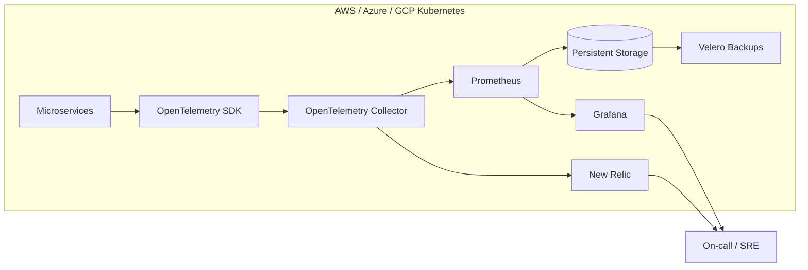

# Observability: New Relic & Prometheus

Production-grade observability platform for microservices teams that need unified metrics, traces, and alerting across multi-cloud Kubernetes clusters.

This project standardizes instrumentation with OpenTelemetry, ingests metrics and traces into Prometheus and New Relic, and keeps dashboards reliable with persistent storage and backup workflows.

## Features
- OpenTelemetry SDK + Collector instrumentation for metrics and traces
- Prometheus + Grafana stack with persistent volumes and HA-ready deployment patterns
- New Relic export for unified dashboards and alert policies across clouds
- Backup-ready monitoring data with Velero workflows
- SLO-oriented alerting for latency, errors, and saturation signals
- Reliability pack assets: Helm chart, dashboards, alert rules, and on-call runbooks
- Built-in telemetry generator for local validation of the pipeline

## Tech stack (and why)
- OpenTelemetry: vendor-neutral instrumentation and telemetry export.
- Prometheus: metrics ingestion, storage, and alerting.
- Grafana: dashboards for SLOs and service health.
- New Relic: unified observability and alerting across clouds.
- Kubernetes + Helm: repeatable deployments and HA-friendly config.
- Velero: backups for monitoring data.
- Docker: local dev stack and quick verification.

## Demo
- Live: TBD
- Video or GIF: TBD
- Screenshots:
  - `docs/screenshots/20251228_1746_Unified Cloud Observability_simple_compose_01kdjt55ncegvv90qnwvzbev87.png`
  - `docs/screenshots/20251228_1746_Unified Cloud Observability_simple_compose_01kdjt55nde0kbfkfd985v68jc.png`
  - `docs/screenshots/20251228_1746_Unified Cloud Observability_simple_compose_01kdjt55nee6b8yna3zqzdqnxa.png`
  - `docs/screenshots/20251228_1746_Unified Cloud Observability_simple_compose_01kdjt55nffz8vwv00ghbnyvse.png`


## Reliability Pack
- Helm chart: `helm/reliability-pack` (ConfigMap dashboards + PrometheusRule alerts).
- Dashboards: `grafana/dashboards/reliability-overview.json`
- Alert rules: `prometheus/alert.rules.yml`
- Runbooks: `runbooks/`

## Quickstart (local)
Prereqs:
- Docker and Docker Compose
- Make (optional)

Run:
```
cp .env.example .env
make dev
# or: docker compose up --build
```

Demo telemetry:
- `telemetrygen` containers emit traces and metrics for `demo-service`.
- In Prometheus, validate the scrape with `up{job="otel-collector"}` and explore metrics labeled with `demo-service`.
- `log-generator` emits sample logs, and Promtail ships them to Loki for the logs panel.

Access:
- Prometheus: http://localhost:9090
- Grafana: http://localhost:3000 (admin / admin)
- Alertmanager: http://localhost:9093
- Loki: http://localhost:3100

Send OTLP telemetry to:
- gRPC: `localhost:4317`
- HTTP: `localhost:4318`

New Relic (optional):
- Set `NEW_RELIC_LICENSE_KEY` in `.env`.
- Run `make newrelic` or set `OTEL_COLLECTOR_CONFIG=config-newrelic.yaml` before `make dev`.

## Dashboards
- Reliability Overview: CPU, memory, request rate, p95 latency, error rate, and recent logs.
- PromQL assumes Micrometer-style metrics (`http_server_requests_seconds_*`) and kube-state metrics; adjust labels/queries for your stack.

## Alerting
- Prometheus rules: `prometheus/alert.rules.yml` (service down, error rate, latency, saturation, telemetry, log ingestion).
- Alertmanager config: `alertmanager/alertmanager.yml` (default receiver is a no-op; wire Slack/PagerDuty for paging).

## Helm chart
```
helm upgrade --install reliability-pack ./helm/reliability-pack
```
Notes:
- Requires `PrometheusRule` CRDs (kube-prometheus-stack) and a Grafana sidecar that loads ConfigMap dashboards.

## Runbooks
On-call guides live in `runbooks/` and map to each alert rule.

## Architecture


OpenTelemetry instruments each service and sends telemetry to a collector per cluster. Prometheus scrapes metrics and feeds Grafana dashboards backed by persistent storage, while New Relic receives metrics and traces for cross-cloud dashboards and alerts. Velero protects monitoring data for recovery and compliance.

## Tests
```
make test
```

## Security
Secrets: use `.env` (see `.env.example`). Store New Relic license keys in Kubernetes secrets or a vault, restrict Grafana access with SSO/RBAC, and apply network policies to limit collector ingress. Enable encryption at rest for Prometheus volumes and lock down cloud IAM for backups.

## Roadmap / tradeoffs
- Add multi-cluster federation (Thanos/Mimir) for long-term retention.
- Add paging integrations (Slack/PagerDuty) and synthetic checks.
- Tradeoff: richer telemetry improves visibility but increases storage and egress costs.

## Notes / limitations
- The local Docker Compose stack is a single-node demo; HA and multi-cloud topology are implemented via Kubernetes/Helm.

## Tags
monitoring, tracing, kubernetes, grafana, prometheus, alertmanager, loki, observability, new relic, opentelemetry

## Skills and tools
Tools and software: docker, kubernetes, grafana, helm, prometheus, alertmanager, loki, new relic, velero, opentelemetry.

Skills: kubernetes, devops, ci/cd.
