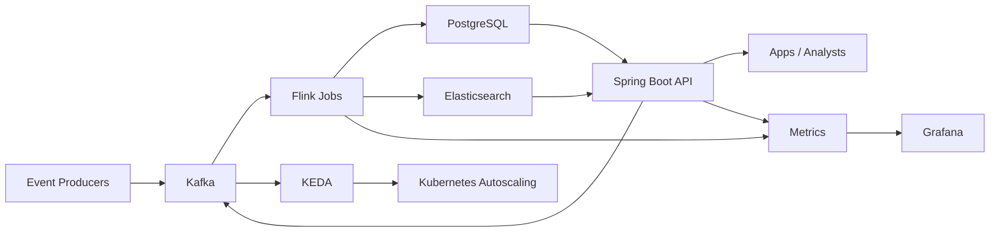

# Predictive Analytics Pipeline on Kubernetes

Event-driven predictive analytics pipeline for data and platform teams that need real-time insights and autoscaling on Kubernetes.

## Features
- Kafka ingestion for durable event streams and backpressure handling
- Apache Flink stateful windows for real-time aggregations and prediction scoring
- PostgreSQL for relational history and Elasticsearch for search/analytics queries
- Spring Boot API for event ingestion and prediction access
- KEDA-ready design for event-driven autoscaling on Kubernetes
- Grafana dashboards for prediction and pipeline visibility

## Tech stack (and why)
- Apache Kafka: ingestion layer with durable streams and replay.
- Apache Flink: low-latency, stateful stream processing and windowed analytics.
- PostgreSQL: transactional storage for prediction history.
- Elasticsearch: fast search and analytics over predictions.
- Spring Boot (Java 17): REST API for ingestion and query access.
- KEDA + Kubernetes: autoscaling based on Kafka lag signals.
- Grafana: dashboards for prediction metrics and pipeline health.

## Demo
- Live: TBD
- Video or GIF: TBD
- Screenshot: `demo/pipeline-overview.svg`
- Screenshot: `demo/grafana-dashboard.svg`

## Quickstart (local)
Prereqs:
- Docker and Docker Compose
- Java 17+ (optional, only if running services outside Docker)

Run:
```
docker compose up --build
```

Generate events:
```
curl -X POST http://localhost:8082/api/events \
  -H "Content-Type: application/json" \
  -d '{"eventType":"purchase","value":42.5,"timestamp":"2024-05-01T12:00:00Z"}'
```

Query predictions:
```
curl "http://localhost:8082/api/predictions?eventType=purchase&limit=10"
```

Search predictions in Elasticsearch:
```
curl "http://localhost:8082/api/predictions/search?q=purchase&limit=5"
```

Open dashboards:
- Flink UI: http://localhost:8081
- Grafana: http://localhost:3001 (admin / admin)

Local ports:
- API: http://localhost:8082
- Kafka: localhost:9094
- PostgreSQL: localhost:5433
- Elasticsearch: http://localhost:9200

## Architecture


Events are published to Kafka, Flink computes tumbling-window aggregations and prediction scores, and results are written to PostgreSQL and Elasticsearch. The Spring Boot API exposes predictions and provides a simple event ingestion endpoint. Grafana dashboards query PostgreSQL for visibility. KEDA scales consumers based on Kafka lag in a Kubernetes deployment.

## API
- OpenAPI: `docs/openapi.yaml`
- Usage examples: `docs/api.md`

## Kubernetes
- Deployment guide: `k8s/README.md`

## Tests
```
cd api
mvn test

cd ../flink
mvn test
```

## Security
Secrets: use `.env` (see `.env.example`). The demo API is unauthenticated; add JWT/OAuth and network policies for production. Use RBAC and namespace isolation for Kubernetes, and restrict Kafka/PostgreSQL/Elasticsearch access to internal services.

## Roadmap / tradeoffs
- Add model retraining workflows and feature store integration.
- Add schema registry and data-quality checks for event validation.
- Tradeoff: dual storage (PostgreSQL + Elasticsearch) improves query flexibility at the cost of higher operational overhead.

## Skills and Deliverables
- Apache Kafka
- Kubernetes
- PostgreSQL
- Apache Flink
- Grafana

Role: Java Engineer.
