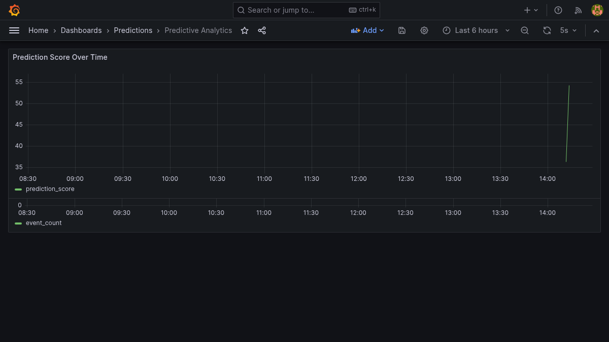
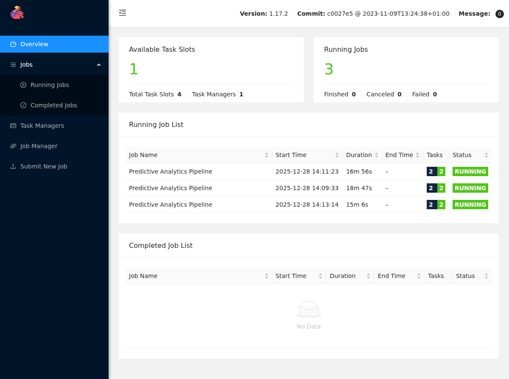
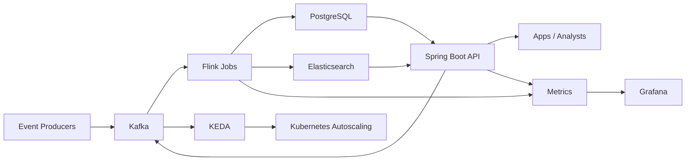

# Predictive Analytics Pipeline on Kubernetes

Real-time predictive analytics pipeline for data and platform teams that need fast insights from streaming IoT telemetry.
15-second pitch: A real-time pipeline that ingests Kafka streams, processes them with Flink for streaming ETL and prediction scoring, writes results to PostgreSQL/Elasticsearch, and visualizes metrics in Grafana. Deployed on Kubernetes to demonstrate end-to-end data engineering and MLOps.

Use case: An IoT sensor network emits temperature events; Flink aggregates and scores anomalies per 30-second window; ops teams monitor results in Grafana.

## Features
- Kafka ingestion for durable event streams and backpressure handling
- Apache Flink stateful windows for real-time aggregations and prediction scoring
- PostgreSQL for relational history and Elasticsearch for search/analytics queries
- Spring Boot API for event ingestion and prediction access
- KEDA-ready design for event-driven autoscaling on Kubernetes
- Grafana dashboards for prediction and pipeline visibility

## Tech stack (and why)
- Apache Kafka: ingestion layer with durable streams and replay.
- Apache Flink: low-latency, stateful stream processing and windowed analytics.
- PostgreSQL: transactional storage for prediction history.
- Elasticsearch: fast search and analytics over predictions.
- Spring Boot (Java 17): REST API for ingestion and query access.
- KEDA + Kubernetes: autoscaling based on Kafka lag signals.
- Grafana: dashboards for prediction metrics and pipeline health.

## Demo
- Live: TBD
- Video or GIF: `demo/pipeline-demo.gif`
- Screenshots: `demo/grafana-dashboard.png`, `demo/flink-ui.png`




## Quickstart (local)
Prereqs:
- Docker and Docker Compose
- Java 17+ (optional, only if running services outside Docker)

Run:
```
make dev
```

Or:
```
docker compose up --build
```

Generate sample events (IoT-style sensor readings):
```
./demo/send-events.sh
```

Verify output:
```
curl "http://localhost:8082/api/predictions?limit=5"
```

Search predictions in Elasticsearch:
```
curl "http://localhost:8082/api/predictions/search?q=sensor&limit=5"
```

Open dashboards (first results appear after the first 30-second window):
- Flink UI: http://localhost:8081
- Grafana: http://localhost:3001 (admin / admin)

Local ports:
- API: http://localhost:8082
- Kafka: localhost:9094
- PostgreSQL: localhost:5433
- Elasticsearch: http://localhost:9200

Configuration:
- Environment variables are used for brokers, topics, and data stores (see `.env.example`).
- Docker Compose wires defaults for local development.

## Architecture


Events are published to Kafka, Flink computes tumbling-window aggregations and prediction scores, and results are written to PostgreSQL and Elasticsearch. The Spring Boot API exposes predictions and provides a simple event ingestion endpoint. Grafana dashboards visualize PostgreSQL data, while Elasticsearch enables fast ad-hoc queries.

### Project structure
- `api/`: Spring Boot ingestion and query API
- `flink/`: Flink streaming job (ETL + scoring)
- `infra/`: database init and schema
- `k8s/`: Kubernetes manifests and KEDA scaling
- `grafana/`: provisioning + dashboards
- `demo/`: screenshots and demo assets
- `docs/`: OpenAPI spec and usage notes
- `docker-compose.yml`: local stack

### Data schema
PostgreSQL schema is defined in `infra/postgres/init.sql`:
```sql
CREATE TABLE predictions (
  id SERIAL PRIMARY KEY,
  event_type TEXT NOT NULL,
  window_start TIMESTAMP NOT NULL,
  window_end TIMESTAMP NOT NULL,
  event_count BIGINT NOT NULL,
  avg_value DOUBLE PRECISION NOT NULL,
  prediction_score DOUBLE PRECISION NOT NULL,
  created_at TIMESTAMP NOT NULL DEFAULT NOW()
);
```

Elasticsearch index `predictions` stores JSON documents with `event_type`, `window_start`, `window_end`, `event_count`, `avg_value`, `prediction_score`, and `generated_at`.

### Processing notes
- Invalid JSON or missing `eventType` is logged and dropped to keep the stream running.
- Prediction scoring uses a lightweight heuristic (placeholder for a real ML model).

## Tests
```
make test
```

Or:
```
mvn -f api/pom.xml test
mvn -f flink/pom.xml test
```

## Security
Secrets: use `.env` (see `.env.example`). Demo credentials are for local use only. The demo API is unauthenticated; add JWT/OAuth and network policies for production. Use RBAC and namespace isolation for Kubernetes, and restrict Kafka/PostgreSQL/Elasticsearch access to internal services. Data used in demos is synthetic.

## Roadmap / tradeoffs
- Add a lightweight ML model for anomaly detection and document its training inputs.
- Add schema registry and data-quality checks for event validation.
- Add integration tests using Testcontainers (Kafka/PostgreSQL).
- Add an end-to-end demo script for Kind-based Kubernetes runs.
- Add OpenTelemetry traces and publish a small throughput benchmark.
- Tradeoff: dual storage (PostgreSQL + Elasticsearch) improves query flexibility at the cost of higher operational overhead.

## Performance
Local benchmark harness (optional):
- Script: `perf/k6/pipeline-load.js`
- Run: `k6 run perf/k6/pipeline-load.js` (set `BASE_URL` to target another host)
- Results: TBD (record throughput and p95 end-to-end latency)

## API
- OpenAPI: `docs/openapi.yaml`
- Usage examples: `docs/api.md`

## Kubernetes
- Deployment guide: `k8s/README.md`

## Skills and Deliverables
- Apache Kafka
- Kubernetes
- PostgreSQL
- Apache Flink
- Grafana

Role: Java Engineer.
