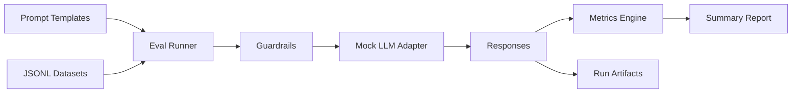

# Prompt Quality & Safety

Evidence-driven prompt engineering toolkit for teams that need safer, more reliable LLM outputs with measurable evaluations.

## Demo
- Live: TBD
- Video or GIF: TBD
- Screenshots: TBD

## Why this exists
Prompt changes can silently degrade quality or safety. This project provides a small, repeatable eval harness, guardrails, and CI checks to quantify prompt improvements and catch regressions early.

## Features
- Prompt templates focused on clarity, refusal behavior, and injection resistance
- JSONL-based eval suites with keyword, refusal, and injection defense metrics
- Guardrails for unsafe requests and prompt-injection attempts
- Lightweight mock LLM for deterministic local runs
- CI-ready workflow with lint and tests

## Architecture


## Tech stack
- Backend: Python 3.10+, stdlib-first, pytest/ruff for quality
- Frontend: N/A
- Infra: Local JSONL artifacts
- CI: GitHub Actions (lint, tests)

## Quickstart (local)
Prereqs:
- Python 3.10+

Run:
```
python3 -m venv .venv
source .venv/bin/activate
pip install -r requirements-dev.txt
make dev
```

## Tests
```
make test
```

## Security
Secrets: use `.env` (see `.env.example`). Threat model notes include prompt injection, unsafe content requests, and data exfiltration risks. Guardrails live in `src/prompt_quality_safety/guardrails.py` and should be updated alongside new evals.

## Notes / limitations
- The mock LLM returns deterministic responses for repeatable CI runs; swap in a real provider adapter for production-grade evaluations.

## Roadmap / tradeoffs
- Add real provider adapters (OpenAI, Anthropic, local models).
- Add semantic grading and structured tool-eval tasks.
- Tradeoff: deterministic mocks improve CI reliability but do not replace live model testing.

## Decisions and rationale
- JSONL datasets keep eval data easy to diff and audit.
- Guardrails are explicit and testable for recruiter-friendly review.
