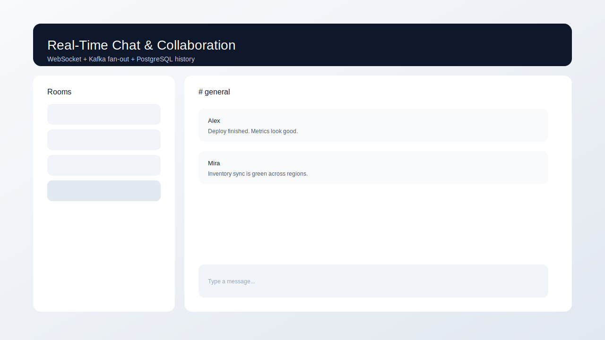
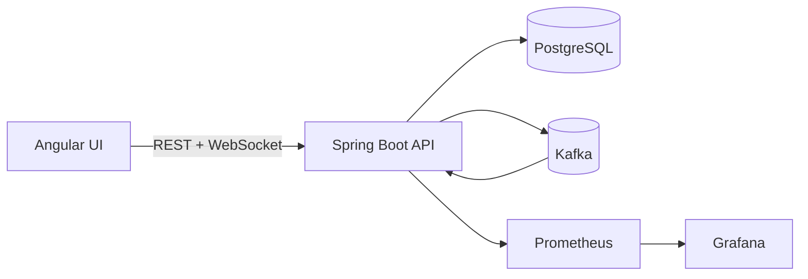

# Real-Time Chat & Collaboration Platform

Real-time chat and collaboration platform for product teams that need low-latency messaging with reliable history and observability.

## Features
- WebSocket/STOMP messaging with room subscriptions
- Kafka-backed fan-out for horizontal scaling
- PostgreSQL persistence for room and message history
- OAuth2 (GitHub) login with session-based access
- Prometheus metrics and Grafana dashboards
- Docker Compose for local dev and Terraform for Kubernetes deploys

## Tech stack (and why)
- Backend: Spring Boot for WebSocket/STOMP, REST APIs, and OAuth2 security.
- Frontend: Angular + RxJS for reactive real-time UI.
- Eventing: Kafka for scalable message fan-out.
- Data: PostgreSQL for durable history and room metadata.
- Observability: Prometheus + Grafana for metrics and dashboards.
- Infra: Docker Compose for local, Terraform for Kubernetes.

## Demo
- Live: TBD
- Video or GIF: TBD
- Screenshots: `docs/screenshots/chat-ui.svg`



## Quickstart (local)
Prereqs:
- Docker and Docker Compose
- GitHub OAuth app (optional unless using demo auth)

Run:
```
docker compose -f infra/docker-compose.yml up --build
```
Or:
```
make dev
```

Auth options:
- OAuth2: set `GITHUB_CLIENT_ID` and `GITHUB_CLIENT_SECRET` in `.env` and use callback `http://localhost:4201/login/oauth2/code/github`.
- Demo mode: set `DEMO_AUTH=true` in `.env` to bypass OAuth locally.

Open:
- Frontend: http://localhost:4201
- Backend: http://localhost:8081

## Architecture


Detailed flow and scaling notes in `docs/architecture.md`.

## Tests
```
mvn -f backend/pom.xml test
```

## Security
Secrets: use `.env` (see `.env.example`). OAuth2 session cookies protect REST and WebSocket access. Demo auth is for local development only.

## Notes / limitations
- Status: MVP; OAuth2 is required unless demo auth is enabled.
- Kafka fan-out is configured for local single-broker usage.

## Roadmap / tradeoffs
- Add presence, typing indicators, and message search.
- Introduce Redis for presence and rate limiting.
- Tradeoff: session-based auth keeps the UI simple but complicates API use from external clients.
