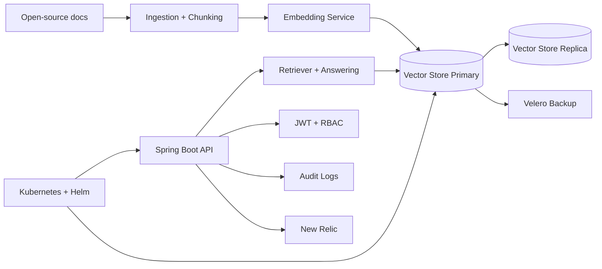

# Secure RAG Service & Knowledge API

Secure retrieval-augmented generation (RAG) microservice for platform and knowledge teams that need question answering over open-source documentation with high availability.

## Features
- Ingests open-source documentation, chunks content, and embeds it into a replicated vector store.
- Spring Boot API for retrieval and question answering.
- JWT-protected endpoints with role-based access control (RBAC).
- Audit logging for access and inference activity.
- Vector stores replicated across availability zones with Velero backups for disaster recovery.
- New Relic monitoring and Helm-based deployment to multi-cloud Kubernetes clusters.

## Tech stack (and why)
- Spring Boot (Java 17): REST API, dependency injection, and production-ready runtime.
- Spring Security + JWT: authentication, authorization, and RBAC enforcement.
- Qdrant (replicated across AZs): vector store for low-latency semantic retrieval and high availability.
- LangChain4j: RAG orchestration and retrieval workflows in Java.
- Kubernetes + Helm: repeatable, multi-cloud deployments and upgrades.
- Velero: backup and restore for stateful vector data.
- New Relic: traces, metrics, and logs for performance and reliability.

## Demo
- Live: TBD
- Video or GIF: TBD
- Screenshots: TBD

## Quickstart (local)
Prereqs:
- Java 17+
- Docker and Docker Compose

Run:
```
# TODO: add docker-compose.yml and seed docs.
# Expected once scaffolding exists:
# ./gradlew bootRun
```

## Architecture


Docs are ingested, chunked, embedded, and stored in a replicated vector store. The Spring Boot API performs retrieval and answer generation behind JWT and RBAC controls, while audit logs capture access events. Velero protects vector data backups, and New Relic provides telemetry for latency and reliability across multi-cloud Kubernetes clusters.

## Tests
```
# TODO: add unit and integration tests.
# Expected once scaffolding exists:
# ./gradlew test
```

## Security
Secrets: use `.env` (see `.env.example`). JWT-based authentication and RBAC restrict access to endpoints. Audit logging records document access and inference activity. Use Kubernetes RBAC, network policies, and least-privilege service accounts for production.

## Roadmap / tradeoffs
- Add eval sets, prompt-injection tests, and regression metrics for RAG quality.
- Add hybrid search (BM25 + vector) and reranking for higher recall.
- Add caching and batching to control embedding and retrieval costs.
- Tradeoff: multi-AZ replication increases cost and operational overhead in exchange for availability.

## Tags
ai, security, docker, knowledge base, spring boot, jwt, kubernetes, helm, rag, new relic, qdrant, vector store

## Skills and tools
Tools and software: ai, security, docker, knowledge base, spring boot, jwt, kubernetes, helm, rag, new relic, qdrant, vector store, langchain4j.

## Project details
Industry: ai, security, docker, knowledge base, spring boot, rag.
