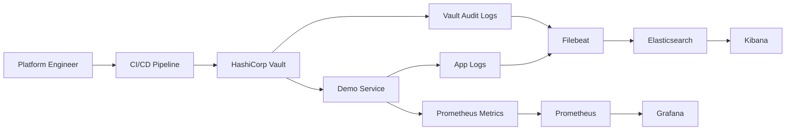

# Secure Secrets Management & Observability Toolkit

Secure secrets management and observability toolkit for platform teams that need automated secrets rotation and compliance-ready telemetry on Kubernetes.

## Features
- HashiCorp Vault with AppRole auth, policies, and audit logs
- Demo service that pulls secrets from Vault and exposes Prometheus metrics
- Filebeat shipping application and Vault audit logs to Elasticsearch with Kibana search
- Terraform modules for Vault policies and Helm-based observability provisioning
- CI/CD rotation workflow sample for automated credentials management
- Docker Compose stack for end-to-end local verification

## Tech stack (and why)
- HashiCorp Vault: dynamic secrets, short-lived tokens, and audit trails.
- Terraform + Helm: reusable IaC modules for policies and observability stacks.
- Docker Compose: reproducible local stack for demos and validation.
- Elasticsearch + Kibana: searchable logs and compliance-friendly audits.
- Prometheus: metrics collection for service health and rotation events.
- Grafana: dashboards for SLOs and compliance reporting.
- Node.js: lightweight demo service with Vault integration and metrics.
- CI/CD: rotation automation hooks.

## Demo
- Live: TBD
- Video or GIF: TBD
- Screenshots:
  - `docs/screenshots/20251228_1751_Secrets Management Toolkit_simple_compose_01kdjtf1f8fw6br0mfmzqtw691.png`
  - `docs/screenshots/20251228_1751_Secrets Management Toolkit_simple_compose_01kdjtf1fafb2857jeew5kqwcv.png`
  - `docs/screenshots/20251228_1751_Secrets Management Toolkit_simple_compose_01kdjtf1fbfkjvfczj5sfnsb8z.png`
  - `docs/screenshots/20251228_1751_Secrets Management Toolkit_simple_compose_01kdjtf1fcew3v42xfqes7yk3a.png`


## Quickstart (local)
Prereqs:
- Docker and Docker Compose
- Make (optional)

Run:
```
make dev
# or: docker compose up --build
```

Verify:
```
curl http://localhost:8080/health
curl http://localhost:8080/secret
```

Rotate a secret:
```
make rotate-secret
```

Open dashboards:
- Vault: http://localhost:8200 (token: dev-root-token)
- Kibana: http://localhost:5601
- Prometheus: http://localhost:9090
- Grafana: http://localhost:3000 (admin / admin)

What to expect:
- `/secret` returns masked values fetched from Vault.
- Kibana shows Filebeat logs (index pattern: `filebeat-*`).
- Grafana dashboards show secret refresh and request metrics.

Kibana note: create an index pattern `filebeat-*` to view logs from the demo app and Vault audit stream.

Terraform (optional):
```
cd terraform/examples/local-vault
export VAULT_TOKEN=dev-root-token
terraform init
terraform apply -var="vault_token=${VAULT_TOKEN}"
```

## Architecture


Vault brokers secrets for workloads via AppRole and audit logging. The demo service fetches secrets on a schedule, emits metrics, and logs access events. Filebeat forwards app logs and Vault audit logs to Elasticsearch, while Prometheus and Grafana surface health and rotation visibility.

## Tests
```
make test
```

## Security
Secrets: use `.env` (see `.env.example`). Vault runs in dev mode for local demos, and Elasticsearch/Kibana security is disabled for simplicity. In production, enable TLS, RBAC, network policies, and authentication for Elastic and Grafana, and use auto-unseal with KMS.

## Notes / limitations
- Status: MVP; local stack runs in dev mode for fast demos.

## Roadmap / tradeoffs
- Add policy-as-code checks (OPA/Conftest) for Vault and Kubernetes manifests.
- Add secret rotation alerts in Grafana and failed-rotation runbooks.
- Support cloud KMS auto-unseal and multi-region Vault replication.
- Tradeoff: running Vault plus Elastic and Prometheus adds operational overhead in exchange for compliance and visibility.

## Skills and Deliverables
- Kubernetes
- HashiCorp Vault
- Terraform
- Prometheus
- Grafana

Role: AI Platform Engineer.
