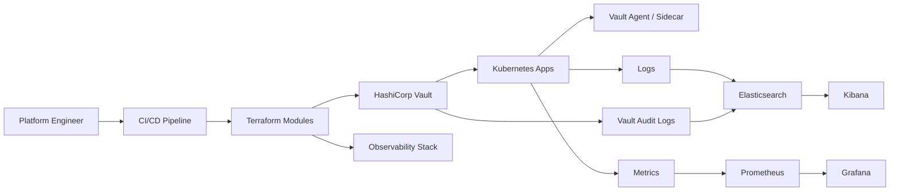

# Secure Secrets Management & Observability Toolkit

Secure secrets management and observability toolkit for platform teams that need automated secrets rotation and compliance-ready telemetry on Kubernetes.

## Features
- HashiCorp Vault for dynamic secrets, policy enforcement, and audit logging
- Terraform modules for Vault policies, Kubernetes auth roles, and observability stack provisioning
- CI/CD pipelines that rotate credentials and revoke leaked secrets automatically
- Centralized log collection into Elasticsearch with Kibana for investigations
- Prometheus metrics with Grafana dashboards for SLOs and compliance reporting
- Kubernetes-native deployment with RBAC and namespace isolation

## Tech stack (and why)
- HashiCorp Vault: dynamic secrets, short-lived tokens, and audit trails.
- Terraform: repeatable IaC for Vault policies and observability stack.
- Kubernetes: workload identity and namespace-level access control.
- Elasticsearch + Kibana: searchable logs and compliance-friendly audits.
- Prometheus: metrics collection and alerting rules.
- Grafana: unified dashboards across logs and metrics.
- CI/CD: pipeline automation for secrets rotation and policy updates.

## Demo
- Live: TBD
- Video or GIF: TBD
- Screenshots: TBD

## Quickstart (local)
Prereqs:
- Docker and Docker Compose
- kubectl and kind or minikube
- Terraform, Vault CLI, Helm

Run:
```
# TODO: add docker-compose.yml, Helm charts, and Terraform modules.
# Expected once scaffolding exists:
# make dev
```

## Architecture


Vault brokers secrets for workloads via Kubernetes auth and Vault Agent injection. Terraform provisions Vault policies, auth roles, and the observability stack. CI/CD pipelines automate secrets rotation and policy updates. Logs are centralized in Elasticsearch with Kibana for investigations, while Prometheus and Grafana provide metrics and dashboards for compliance and reliability.

## Tests
```
# TODO: add unit tests for Terraform modules and pipeline checks.
# Expected once scaffolding exists:
# make test
```

## Security
Secrets: use `.env` (see `.env.example`). Vault enforces least privilege with short-lived tokens, audit logging, and revocation on rotation. Restrict access with Kubernetes RBAC, namespace boundaries, and network policies. Enable secret scanning in GitHub.

## Roadmap / tradeoffs
- Add policy-as-code checks (OPA/Conftest) for Vault and Kubernetes manifests.
- Add secret rotation metrics and alerting for failed rotations.
- Support cloud KMS auto-unseal and multi-region Vault replication.
- Tradeoff: running Vault plus Elastic and Prometheus adds operational overhead in exchange for compliance and visibility.

## Skills and Deliverables
- Kubernetes
- HashiCorp Vault
- Terraform
- Prometheus
- Grafana

Role: AI Platform Engineer.
